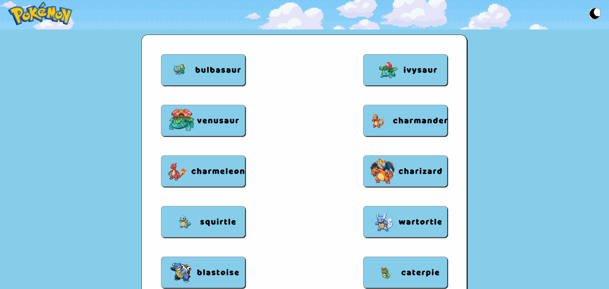
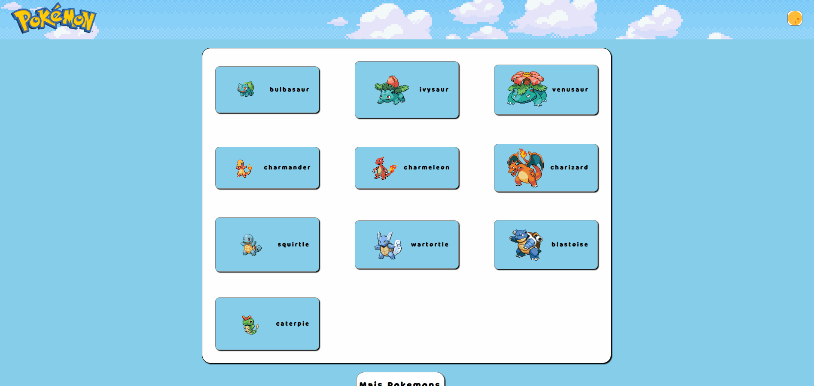
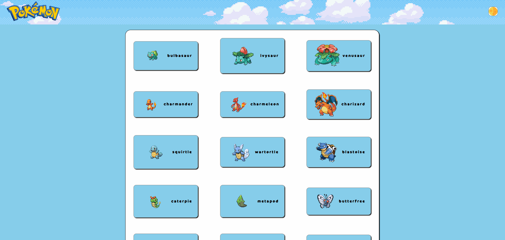

# []

## GIF do projeto inteiro.
[]

## Tecnologias utilizadas

- HTML
- CSS
- JavaScript
- React

## Como utilizar

Os pokemons irão carregar de acordo com seu respectivo número, começando com 10 pokemons, o botão "MAIS POKEMONS" irá carregar mais 10 pokemons.
[]

E caso se interesse por algum desses pokemons, e queira saber mais detalhadamente sobre, basta clicar no quadrado dele que você irá ser redirecionado para a página de detalhes dele.
[]

## Temas

Caso não goste do tema inicial que é o tema claro, clicando na Lua na parte superior direito você consegue mudar o tema de sua página.
[]

## Anotações e Dificuldades

Primeiro projeto feito com react, tive e ainda tenho dificuldade com o styledcomponents, vou criar outras versões desse projeto adicionando uma busca, mais temas e filtros.

### Feito por Saullo Reis dos Santos.